# "Ejercicio de Markdown"

## Instalación de dotnet core 2.2.
Lo primero que tenemos que hacer es
descargar el archivo de instalacion del siguiente lugar.
[Lugar] (https://dotnet.microsoft.com/download/dotnet-core/3.0)
es importante bajar el SDK Core , por que **vamos a programar**.

La pagina se ve asi:
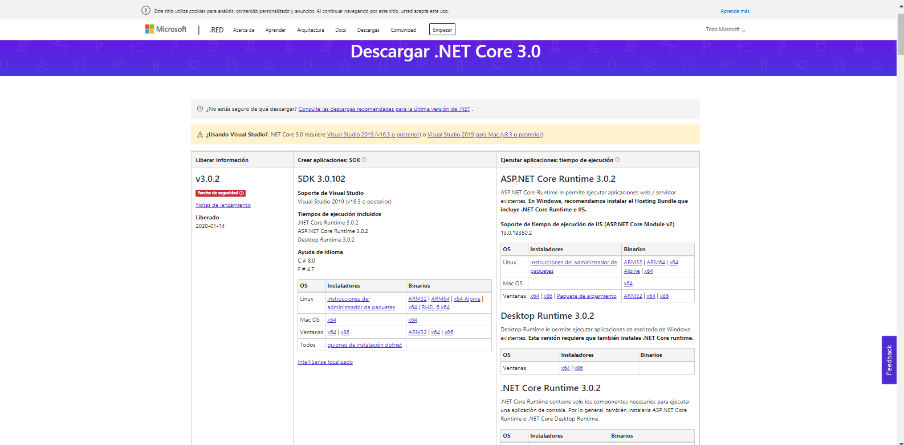

## Instalación y configuración de Visual Studio Code para C#.

Link Para Descargar el Visual Code

[Lugar] (https://code.visualstudio.com)

paso 1. Primero tenemos la imagen que es donde se descargara el programa 
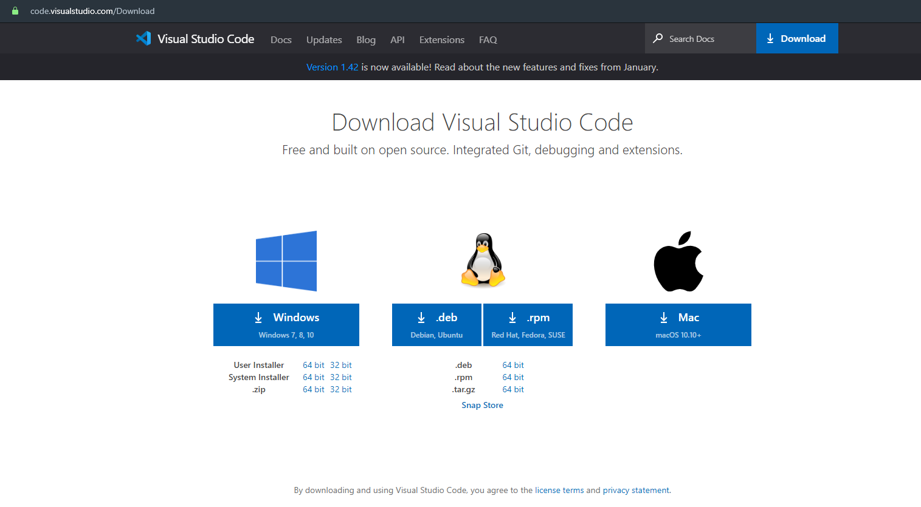

Paso 2. Luego como todo programador normal le da en acepto el acuerdo sin leerlo por que da hueva y siguiente

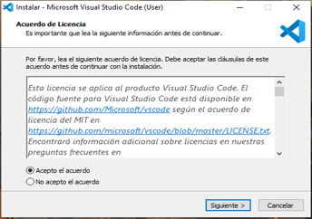

Paso 3. Luego le damos siguiente de nuevo

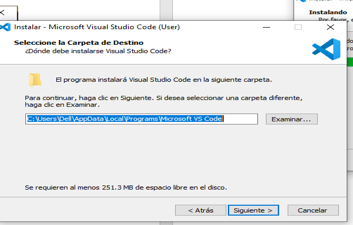

Paso 4. Siguiente...

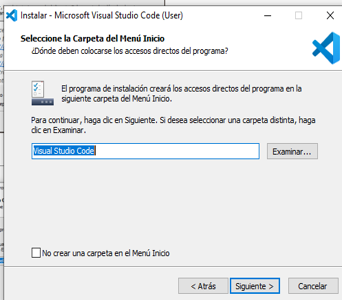

Paso 5. Aceptamos todo lo de las tareas adicionales y siguiente

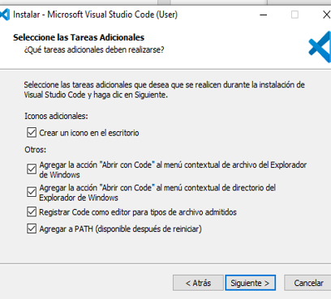

Paso 6. Le damos instalar

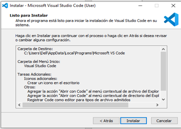

Paso 7. Se esta instalando espera pacientemente 

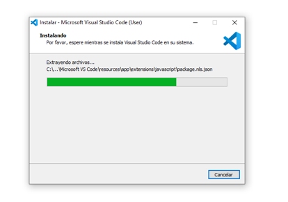

Paso 8. Y finalizar wiiiii

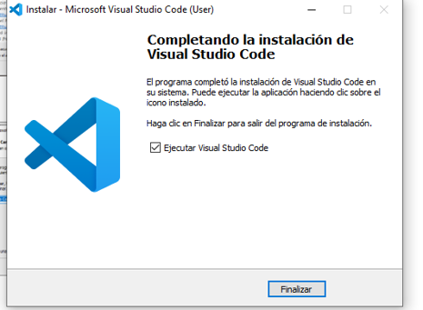

## Instalación del Netcore

[Lugar]

Paso 1. Primero buscamos el programa acto seguido le damos en descargar 

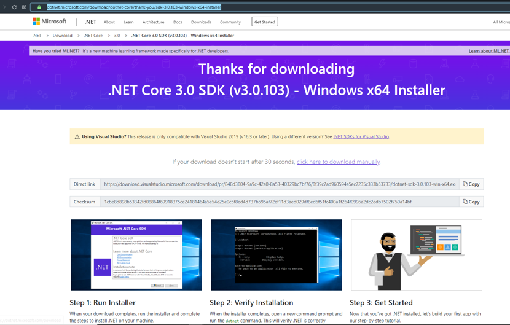

Paso 2. Le damos a ejecutar

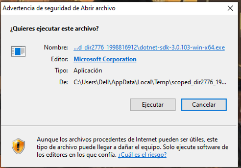

Paso 3. Le damos a install

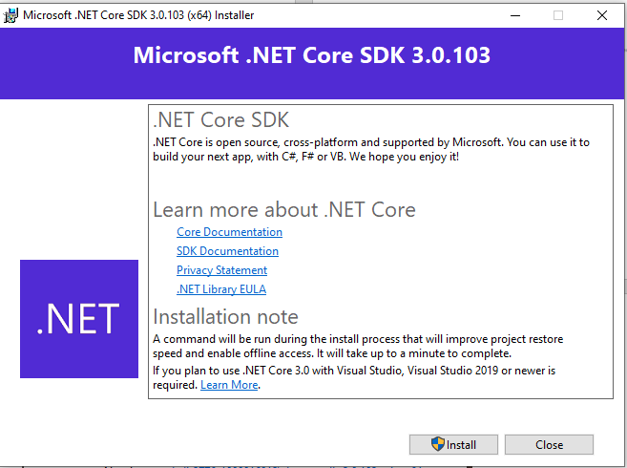

Paso 4. Esperamos pacientemente de nuevo...

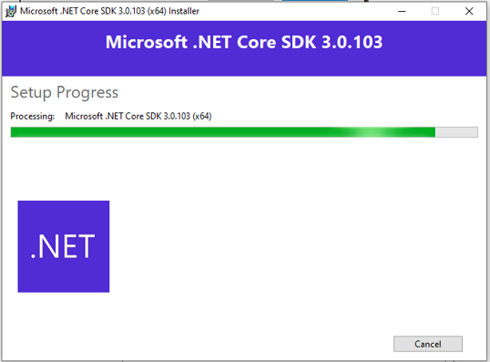

Paso 5. Le damos a Close y listo otro trabajo bien hecho

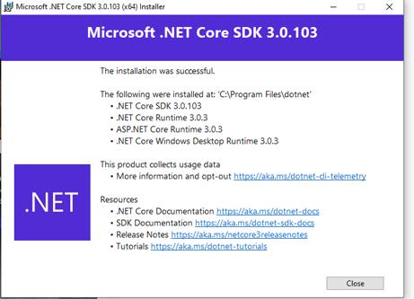

## Instalación de git. conectado a tu cuenta de GitHub y VSC.

Paso 1. Le damos en descargar y esta listo

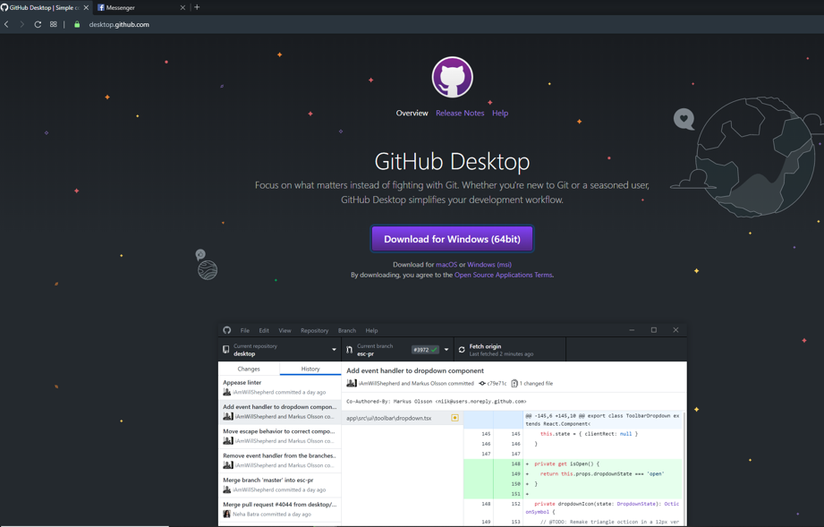

Paso 2. lo buscamos en nuestro escritorio

Paso 3. ingresamos cuenta 

Paso 4 Y 5. Ledamos en Repository y luego en donde lo queremos abrir y listo

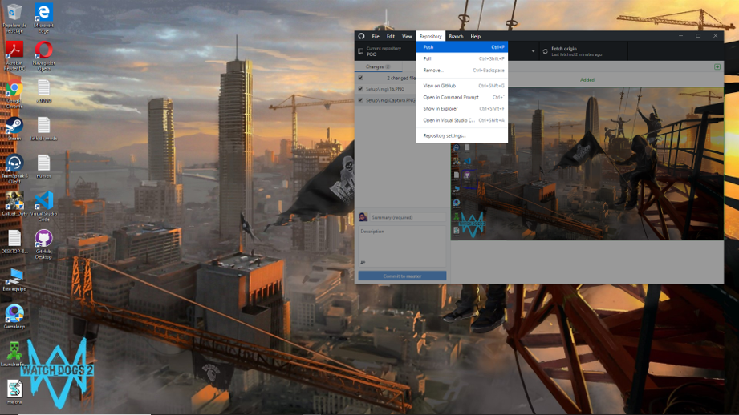